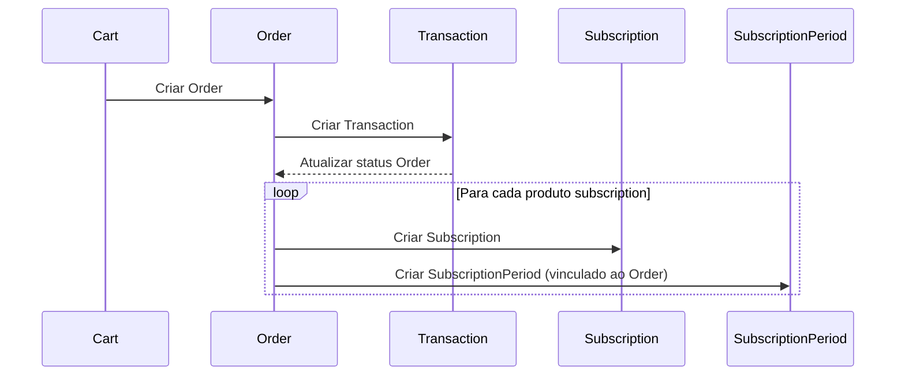
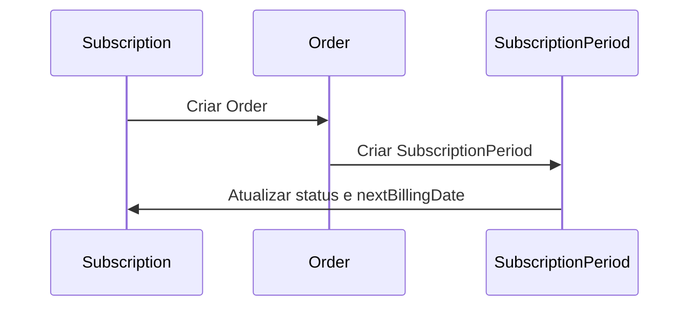

# 📊 Diagramas de Fluxo - Checkout e Cobrança Recorrente

## 🔄 FLUXO 1: Checkout Inicial

Este fluxo ocorre quando um cliente finaliza um carrinho de compras contendo produtos de assinatura.



---

## 🔄 FLUXO 2: Cobrança Recorrente Automática

Este fluxo ocorre automaticamente via scheduler quando uma subscription atinge sua próxima data de cobrança.



---

## 📋 Resumo dos Componentes Principais

### **Fluxo 1 - Checkout Inicial:**
1. **OrderService.createOrder()**: Cria Order e Transaction baseado em Cart
2. **ChargeProvider.charge()**: Processa pagamento com gateway externo
3. **SubscriptionService.create()**: Cria Subscription para cada produto de assinatura
4. **SubscriptionService.createPeriod()**: Cria SubscriptionPeriod vinculado ao Order

### **Fluxo 2 - Cobrança Recorrente:**
1. **RecurringBillingSchedulerService**: Scheduler cron diário
2. **RecurringBillingService.processDueSubscriptions()**: Busca subscriptions vencidas
3. **RecurringBillingService.processSubscriptionBilling()**: Processa cobrança individual
4. **OrderService.createRecurringOrder()**: Cria Order e Transaction para renovação
5. **SubscriptionService.createPeriod()**: Cria novo período vinculado ao novo Order
6. **WebhookService.processWebhook()**: Recebe atualização do gateway
7. **SubscriptionService.findAndUpdateSubscriptionByTransaction()**: Atualiza status via webhook

---

## 🔗 Relacionamentos entre Entidades

```
Order (1) ──────< (N) SubscriptionPeriod
  │                    │
  │                    │
  └─── (N) Transaction │
                       │
                       │
                 Subscription (1)
```

- **Order** pode ter múltiplos **SubscriptionPeriods** (quando múltiplos produtos subscription no checkout)
- **SubscriptionPeriod** está vinculado a um único **Order**
- **Order** pode ter múltiplas **Transactions** (histórico de tentativas)
- **Subscription** tem múltiplos **SubscriptionPeriods** (um por ciclo de cobrança)

---

## 🎯 Pontos Importantes

### **Checkout Inicial:**
- ✅ Um Order pode criar múltiplas Subscriptions (um produto subscription = uma subscription)
- ✅ Cada SubscriptionPeriod é vinculado ao mesmo Order do checkout
- ✅ Status inicial do SubscriptionPeriod baseado no Order.status
- ✅ Se Order.status = CONFIRMED → SubscriptionPeriod.status = PAID

### **Cobrança Recorrente:**
- ✅ Scheduler busca subscriptions com `nextBillingDate <= hoje`
- ✅ Cria novo Order para cada renovação (origin: SUBSCRIPTION)
- ✅ Cria novo SubscriptionPeriod vinculado ao novo Order
- ✅ Se pagamento confirmado imediatamente → atualiza status agora
- ✅ Se pagamento em processamento → aguarda webhook atualizar
- ✅ Webhook atualiza Order → Transaction → SubscriptionPeriod → Subscription
- ✅ Webhook atualiza `nextBillingDate` quando pagamento confirmado

